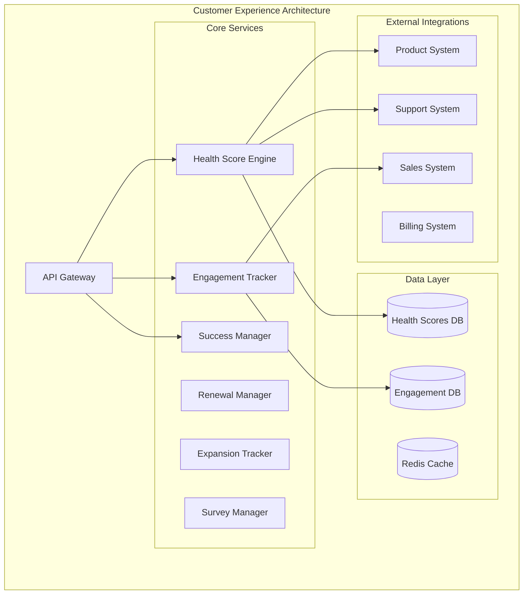

# Customer Success and Health Management

## Overview

The Customer Success and Health Management is a comprehensive customer success platform for health scoring, engagement tracking, retention management, and expansion opportunities.

## Purpose and Capabilities

- **Health Scoring**: Multi-dimensional customer health with usage, engagement, and sentiment signals
- **Engagement Tracking**: Customer touchpoints, interactions, and relationship strength
- **Success Planning**: Customer goals, milestones, and success metrics tracking
- **Renewal Management**: Proactive renewal campaigns, risk identification, and win-back strategies
- **Expansion Tracking**: Upsell/cross-sell opportunities based on usage and engagement
- **Survey Management**: NPS, CSAT, and custom surveys with sentiment analysis
- **Customer Segmentation**: Cohort analysis, lifecycle stages, and targeted interventions

## Architecture Diagram



## Tech Stack

### Backend
- **Runtime**: Node.js 20 LTS
- **Framework**: Express.js with TypeScript
- **API**: RESTful + GraphQL
- **Authentication**: JWT with OAuth2.0

### Data Storage
- **Primary Database**: PostgreSQL 15
- **Time-Series**: InfluxDB
- **Cache**: Redis 7
- **Analytics**: ClickHouse

### Infrastructure
- **Container Orchestration**: Kubernetes
- **Message Queue**: RabbitMQ

## Integration Points

### Upstream Dependencies
- **Product System**: Usage data, feature adoption, login frequency
- **Support System**: Ticket volume, resolution times, satisfaction scores
- **Sales System**: Contract value, renewal dates, expansion opportunities
- **Billing System**: Payment health, subscription changes, churn signals

### Downstream Consumers
- **Sales System**: Expansion opportunities, renewal forecasts, account health
- **Support System**: At-risk customers, escalation priorities
- **Product System**: Feature adoption metrics, user feedback
- **Marketing**: Success stories, case study candidates, advocacy opportunities

## Quick Start

```bash
git clone https://github.com/ionoi-inc/customer-experience-system-architect.git
cd customer-experience-system-architect
npm install
cp .env.example .env
npm run migrate
npm run dev
```

## Performance Benchmarks

- Health score calculation: <500ms (p95)
- Customer profile load: <100ms (p95)
- Engagement metrics: <200ms (p95)
- Survey delivery: <300ms (p95)

## Security

- Customer data protection
- GDPR compliance
- Encrypted survey responses
- Role-based access control
- Audit logging

## License

Proprietary - ionoi-inc
